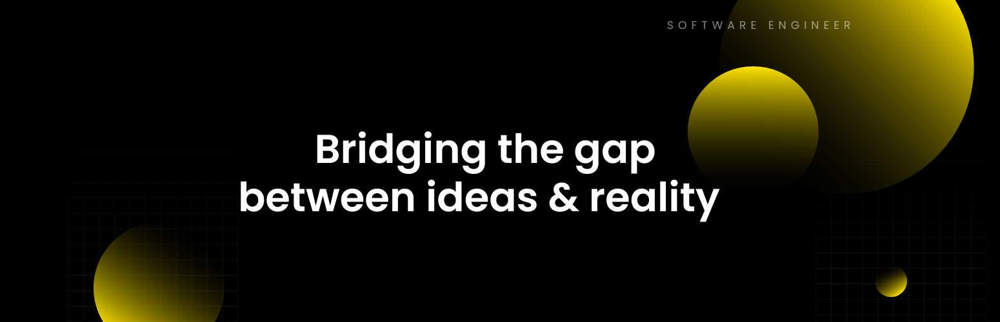

  
<strong>SOME OF THE STUFF I DID :</strong>
  

 

     
  <b>Exaya</b>    ERP | Transportation Industry Company <a href="https://exaya.vercel.app">exaya.app</a>

 

     
  <b>Monedo</b>    Track daily financial expenses easily with <a href="https://monedo.vercel.app">monedo.app</a>

 

 

 

-  Looking to collaborate on innovative and challenging projects.
-  Excited about what we can build with AI.
-  Checkout my **[resume](https://drive.google.com/file/d/1uWEIOPXvljmVd2ppGNZ5q4QldBlBUuGC/view?usp=drive_link)**

  

#### My Stack

