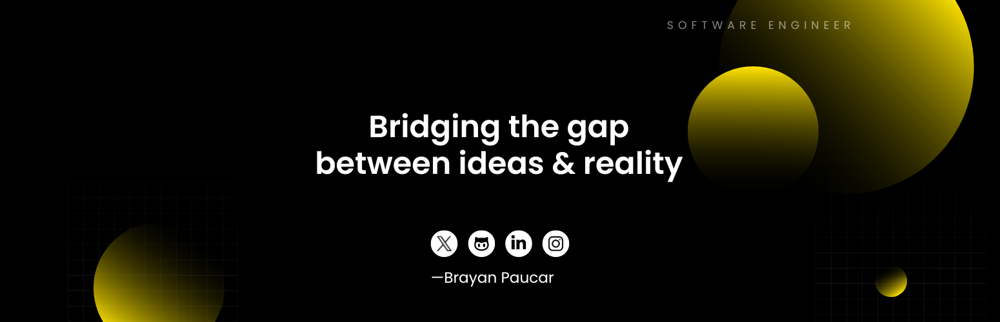

 

  
Experienced developer specialized in web and mobile development.   Passionate about transforming ideas into impactful solutions.  Here are a few things I did :
  

 

     
  <b>Exaya</b>    Integral Software for Organic Processes  Management  Powered with AI   <a href="https://exaya.vercel.app">exaya.app</a>

 

     
  <b>Expense Tracker</b>    Track daily financial expenses with ease.  Made with Expo   <a href="https://expensetrackerweb.vercel.app">expensetracker.app</a>

 

 

 

### More About Me:

-  Looking to collaborate on innovative and challenging projects.
-  Excited about what we can build with AI.
-  Checkout my **[resume](https://drive.google.com/file/d/1uWEIOPXvljmVd2ppGNZ5q4QldBlBUuGC/view?usp=drive_link)**

  

#### Tech Skills I Excel In

#### Currently Learning

### When I'm not coding:

- 👟 Hitting the tennis court
- 🏊‍♂️ Swimming laps
- 🏋️‍♂️ Working out at the gym
